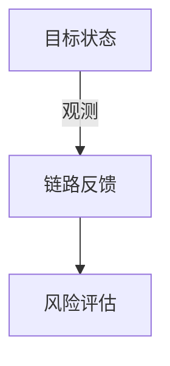

# 冒烟测试文档

这是一个用于 GUI 冒烟测试的样例文档。

行内公式：\(\rho_{bb'}\)。

$$
\mathbf{z}_k = \mathbf{H}_k \mathbf{x}_k + \mathbf{n}_k
$$

```mermaid
graph TD
  A["目标状态"] -->|观测| B["链路反馈"]
  B --> C["风险评估"]
```

## 引用索引

- 参考资料一 citeturn1search0
